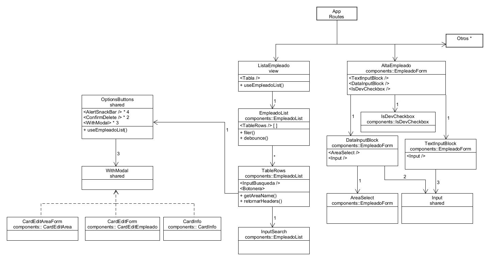

<h1>Challenge Alta Personal</h1> 

<br>

DEPLOY:

[https://germanmacchia.github.io/alta_personal_frt/](https://germanmacchia.github.io/alta_personal_frt/)
<br>

Acceso

```
email: 'admin@mail.com'
password: 'admin'
```

o a través de cuenta Google

<br>
NUEVA VERSIÓN:

[Alta empleados V3](https://github.com/GermanMacchia/alta-empleados-v3)

<br>
Repositorio Back End:

[https://github.com/GermanMacchia/alta_personal_bck](https://github.com/GermanMacchia/alta_personal_bck)
<br>

<br><br>

# Índice

A. [Librerias utilizadas](#librerias-utilizadas)

B. [Creación](#creación)

c. [Documentacion relevante](#documentación-relevante)

D. [Documentación del proyecto](#documentación-del-proyecto)

- [Técnologias](#tecnologías)

- [Funcionalidades](#funcionalidades)

  - [Helpers](#helpers)

  - [Hooks](#hooks)

  - [Shared](#shared)

  - [Composición](#composición)

<br><br><br>

# Librerias utilizadas

React-ts (Vite + CWS)

Tanstack Query

React Router

Material UI

React Hook Forms

Axios

Firabase

<br><br><br>

# Inicialización

1. Clonar Repositorio

2. Instalar dependencias

```
npm install
```

3. Establecer Variables de entornod

   a. URL API

   b. Variables de cuenta Firebase

4. Iniciar el proyecto

```
npm run dev
```

<br><br><br>

# Creación

1. Iniciar proyecto

```
npm create vite
```

2. Instalar dependencias

```
npm i @mui/material @emotion/react @emotion/styled @mui/icons-material
npm i @tanstack/react-query
npm i @tanstack/react-query-devtools
npm i react-router-dom
npm i react-hook-form
npm i axios
npm i firebase
npm i --save-dev @mui/types
npm i --save-dev @types/react-router
npm i --save-dev @types/react-router-dom
npm i --save-dev vitest
npm i --save-dev @testing-library/react
npm i --save-dev @testing-library/jest-dom
```

3. Opcional

   a. Configuracion eslint

   b. Configuracion prettier

   c. Configuracion para deploy

<br><br><br>

# Documentación relevante

[React hook forms](https://react-hook-form.com/)

[React Router](https://reactrouter.com/en/main)

[TanStack React Query](https://tanstack.com/query/latest)

[Material UI](https://mui.com/)

[Firebase](https://firebase.google.com/docs?hl=es-419)

[Eslint](https://eslint.org/)

[Prettier](https://prettier.io/)

<br><br><br>

# Documentación del proyecto

El proyecto es un CRUD elaborado con Vite+CWS y typescript.<br>
Contiene una gran variedad de liberias muy útiles para implementar en cualquier proyecto.
El diseño fue elaborado a partir del desarrollo (sin maquetado previo).<br>
Cuenta con responsive design para desktop y movil.<br>

## Tecnologías

**React hook forms**<br>
React hook forms nos permite hacer formularios sin necesidad de controlarlos por medio de
funciones. De esta manera reducimos los renders de nuestros componentes.
Además nos otorga hooks para evaluar errores, establecer requerimientos, saber si esta
escrito el input ets.

**React Router**<br>
Esta libreria nos permite generar rutas en nuestro proyecto.<br>
Aunque el desarrollado en esta ocación se trata de una implementación básica, React Router nos ofrece una variedad de utilidades.

**TanStack React Query**<br>
Esta libreria nos permite generar peticiones y mutaciones a una api determinada. <br>
Una de las mayores utilidades que presenta esta librería es que guarda los datos en caché. Esto
presenta un cambio rotundo en la forma que desarrollabamos ya que (dependiendo las necesidad)
ya no es necesario establecer un store en la app.<br>
React query realizará una petición y si la necesitamos en otro componente podemos obtenerla
mediante los hooks que provee. Además podemos establecer una enorme cantidad de configuraciones
para realizarlas.<br>
React Query nos provee un devtool incluido. Se trata de una ui que nos permite ver el estado
de nuestas query.

**Material Ui**<br>
Material UI es una conocida libreria de bootstraps que nos proporciona componentes _out of the box_
para poder desplegar en nuestra aplicacion o página web. Aunque este proyecto no lo presenta,
se pueden configurar tematicas centralizadas para llevar una linea en el diseño de nuestra apliación.

## Funcionalidades

<br />

La aplicación nos permite generar una lista de empleados con la ayuda de una API que sostiene la lógica necesaria
para articular las peticiónes y la capa de persistencia.
Podremos establecer nuevas entradas con un formulario, subir una imagen del empleado, asignarlo a un área determinada, y modificar dichas entradas de ser necesario.

### Helpers >>

<br />

**Capitalize**<br>
Capitalize es una función que nos permite establecer la primera letra como mayuscula <hr>

**Debounce**<br>
Debounce es una funcion que tiene un timer para llamar un callback. De esta manera evitamos
llamar repetidamente una función.<hr>

**Filter**<br>
Filter es un filtro básico que devuelve un array de acuerdo a lo que se le envia en un input<hr>

**Sleep**<br>
Sleep es una función pensada para el desarrollo que permite emular la espera de una petición
para poder visualizar los componentes de progreso.<hr>

<br />

### Hooks >>

<br />

**useAreaForm**<br>
Contiene queries y mutaciones para la interfaz Area <hr>

**useEmpleadoForm**<br>
Contiene query de getAreas y mutacion para Empleado<hr>

**useAvatar**<br>
Contiene queries y mutaciones para subir, elimianar y cambiar avatares.<hr>

**useEmpleadoList**<br>
Contiene queries y mutaciones para la interfaz de la Tabla <hr>

**usePagination**<br>
Contiene la lógica necesaria para interactuar con el componente TablePagination <hr>

**useAuthForm**<br>
Contiene queries y mutaciones para el registro, el login regular y a través de Google <hr>

<br>
<br>

### Shared >>

<br>

**OptionsButtons**<br>
Despliege de botoneras en tablas. Sostiene la lógica para las renderizar mensajes de alertas y modales.<br>
Esta compuesta por un render condicional, dependiendo del estado de sus hooks va a renderizar
modales, confirmaciones o Alertas.<br>Debido a las diferencias es necesario indicar si es una tabla
de usuarios para que cambie la disposición de los iconos.<hr>

**WithFormProvider**<br>
Es un HOC que actúa como _wraper_ para proveer las funcionalidades de react hook forms<hr>

**WithModal**<br>
Es un HOC que actúa como _wraper_ para proveer las funcionalidades de Mui Modal.<hr>

**ConfirmDelete**<br>
Componente para confirmar la acción de delete.<hr>

**AlertSnackBar**<br>
Componente para alertar al usuario de mensajes y errores<hr>

**Input**<br>
Custom input para simplificar la declaración de los formularios, otorgando nombres y reglas según
las especificaciones de React Hook Form. <hr>

<br>

### Composición >>

<br>


<br>

La aplicación consta de cinco rutas las cuales cuatro son hijas de la primera, siendo la app principal.<br>
